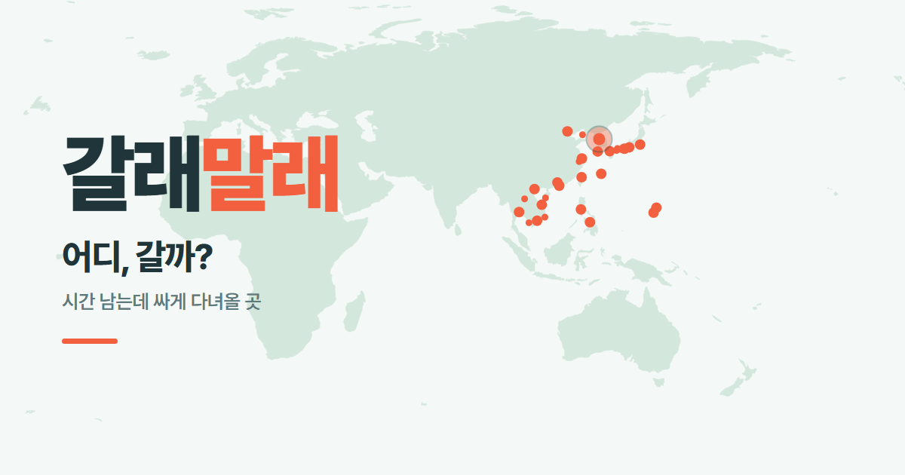
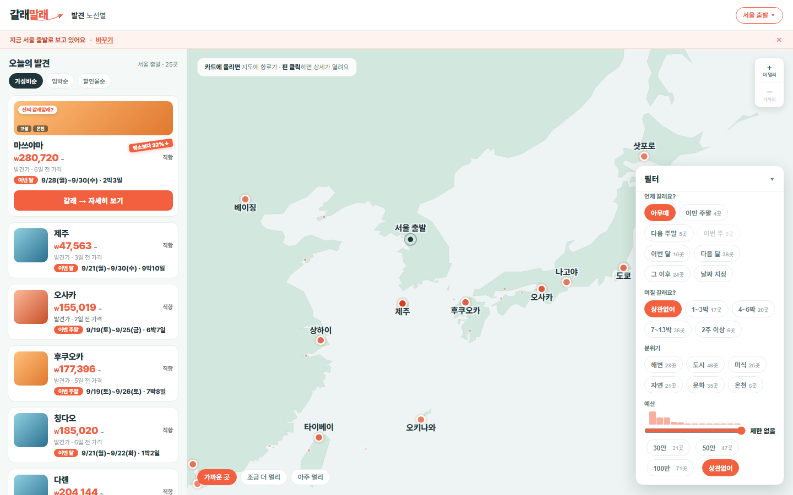
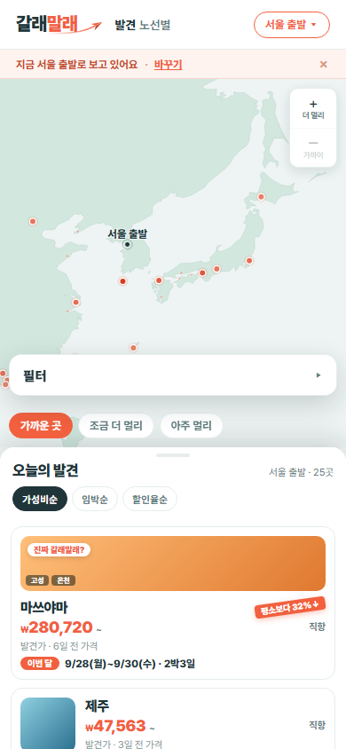

<p align="center">
  <a href="https://galmal.kr"></a>
</p>

# 갈래말래 — 프론트엔드

[](https://github.com/RYU-TOMI/galmal-frontend/actions/workflows/deploy.yml)
[](https://github.com/RYU-TOMI/galmal-frontend/actions/workflows/test.yml)

**[galmal.kr](https://galmal.kr) 의 화면을 굽는 저장소.** 백엔드가 발행한 v1 API 를 빌드 때 받아 정적 HTML 로 만들고 GitHub Pages 에 올린다.

## 한눈에

<!-- 발췌: galmal-plan/PRODUCT.md 포지셔닝 · COPY.md 태그라인 — 고칠 땐 거기부터 -->
> **어디, 갈까?**
> 목적지를 정하지 않은 사람에게, 평소보다 싸게 갈 수 있는 곳을 지도로 보여주는 한국 출발 항공권 발견 서비스.

| 데스크톱 — 발견 지도 · 카드 피드 · 필터 | 모바일 — 지도 위 3단 시트 |
|---|---|
|  |  |

- **발견 홈** — 출발지(서울·부산·대구·제주)를 고르면 그날 싼 여행지가 지도에 핀으로 찍힌다. 가까운 곳 → 조금 더 멀리 → 아주 멀리 3단계로 넓혀 본다
- **필터** — 언제 · 며칠 · 분위기 · 예산. 조건에 안 맞는 곳은 지우지 않고 흐리게 한다
- **상세** — 카드를 누르면 지도가 그 도시로 미끄러지고, 예약처 여러 곳을 나란히 비교한다. 주소(`#SEL-FUK`)로 공유된다
- **노선 페이지** — 노선마다 한 장. 최근 30일 최저가 추이, 출발 월·요일별 최저가, 항공사별 요금, 메일 알림 신청

## 세 저장소

<!-- 발췌: galmal-plan/PROJECT.md §저장소 셋 — 고칠 땐 거기부터 -->
| 저장소 | 무엇 | 서빙 |
|---|---|---|
| [`galmal-plan`](https://github.com/RYU-TOMI/galmal-plan) | 제품·스펙·결정 기록·계약의 **이유** · `design/` 목업 | — |
| [`galmal-backend`](https://github.com/RYU-TOMI/galmal-backend) | 수집·판정·**v1 API**·계약 정본 `contract/v1/`·크론 | `https://api.galmal.kr/v1/` |
| **[`galmal-frontend`](https://github.com/RYU-TOMI/galmal-frontend)** ← 여기 | **v1 을 받아 화면을 굽는다** | **`https://galmal.kr`** |

경계는 **데이터 / 화면**이다. 백엔드는 사실(JSON)만 내고 HTML 을 만들지 않는다. 프론트는 DB 를 모르고 계약만 읽는다.
**어느 기간을 보나(창)는 백엔드가, 보여줘도 되나(임계)는 프론트가** 정한다.

## 어떻게 도나

<!-- 발췌: galmal-plan/PROJECT.md §하루의 흐름 — 고칠 땐 거기부터. 크론 시각은 galmal-backend 의 collect.yml 이 정본 -->
```
galmal-backend   매일 아침(KST) 크론 — 수집 → 판정 → v1/*.json 발행 → api.galmal.kr
      │
      └─ repository_dispatch(api-updated · generated) ─┐
                                                       ▼
galmal-frontend  deploy.yml
      ① v1 응답 전부를 받는다 ─ 한 발행분이 아니면 여기서 멈춘다
      ② 어휘 매핑·칩 검사     ─ 계약과 어긋나면 여기서 멈춘다
      ③ public/ 복사 → HTML·sitemap·build.json → GitHub Pages(galmal.kr)
      │
      └─ 다음 날 백엔드 점검이 galmal.kr/build.json 을 읽어 「사이트가 뒤처졌나」를 본다
```

**서버가 없다.** `api.galmal.kr` 도 `galmal.kr` 도 GitHub Pages 가 파일을 내보낼 뿐이다.
API 를 받는 것은 방문자 브라우저가 아니라 **빌드**다 — 그래서 CORS·로딩 상태·재시도가 화면에 없다.
백엔드가 자체 서버가 되는 날 바뀌는 것은 `--api` 에 넣는 주소 하나다.

## 기술 스택

| 쓰는 것 | 안 쓰는 것 |
|---|---|
| Python 3.12 **표준 라이브러리만** — 정적 생성(`site/`) | 프레임워크 · Node/npm · 번들러 |
| 순수 JS(ES5) + CSS — `public/assets/discover.js·css` | 런타임 API 호출 · 런타임 CDN(폰트 제외) |
| 지도 투영만 `d3-geo` · `d3-array`(저장소에 벤더링) | 서버 · DB |
| GitHub Actions + GitHub Pages + 커스텀 도메인 | 도메인 외 비용 |

## 폴더 구조

```
site/                 빌드 — 진입점 build.py
  build.py            받기 → 검사 3개 → 정적 자산 복사 → HTML·XML → build.json
  snapshot.py         v1 응답 전부를 한 번에 받고 한 발행분인지 본다
  coverage.py         어휘를 키로 쓰는 JS 매핑(색·거리 단계)이 어휘를 다 덮는지
  home.py             발견 홈 — 필터 칩은 /v1/vocab.json 으로 그린다
  route.py            노선 페이지 · 「주장해도 되나」 임계 · 구독 mailto
  shell.py charts.py fmt.py seo.py    <head>·CSS · SVG 차트 · 날짜 표기 · sitemap
public/               그대로 서빙되는 파일 — assets/(JS·CSS·d3·og.png) · data/world.geojson
fixtures/v1/          v1 응답 사본(한 발행분). 손으로 고치지 않는다 — capture.py 로 받아 적는다
tests/                단위 테스트
.github/workflows/    deploy.yml(굽고 배포) · test.yml(테스트 + 픽스처 빌드)
```

## 로컬 실행 · 테스트

설치할 것이 없다. Python 3.12 만 있으면 된다.

```bash
python site/build.py --api fixtures/v1 --out dist                 # 네트워크 없이, 픽스처로
python site/build.py --api https://api.galmal.kr/v1 --out dist    # 라이브 API 로
python -m http.server 8000 --directory dist                       # http://localhost:8000

python -m unittest discover -s tests -v                           # 출력 끝의 OK 를 확인한다
python fixtures/capture.py https://api.galmal.kr/v1               # 픽스처를 새 발행분으로 다시 받기
```

## 배포 · 운영

`main` 에 push(`.md` 만 바뀐 커밋 제외) · 백엔드의 `repository_dispatch` · 수동 실행, 세 가지가 `deploy.yml` 을 돌린다.

**틀린 화면을 내보내느니 멈춘다.** 아래 중 하나라도 어긋나면 **한 파일도 쓰기 전에** 빌드가 실패하고, 사이트는 직전 배포본으로 남는다.

| 검사 | 무엇을 막나 |
|---|---|
| 스냅숏 | 받은 응답들의 `generated` 가 한 발행이 아니다 — CDN 캐시가 파일마다 따로라 **날짜가 섞인 사이트**가 나갈 수 있다 |
| 매핑 포괄 | 새 태그·새 거리 구분에 색·단계가 없다 — 예전엔 기본값으로 **조용히** 폴백했다 |
| 칩 | 그려진 필터 칩이 계약 어휘와 (순서까지) 다르다 — JS 가 목록을 그 칩에서 읽는다 |
| 산출물 점검 | JS·CSS·지도 파일이 빠졌다 — HTML 은 멀쩡한데 **화면만 백지**가 되는 경우 |

함께 나가는 `build.json` 의 `api_generated` 는 「어느 발행분으로 구웠나」다. 백엔드가 자기 API 의 `generated` 와 **같은지** 비교해, 배포가 조용히 멈춘 것을 잡는다. 지우지 않는다.

## 설계에서 고른 것

- **API 는 빌드가 받는다(SSG).** 데이터가 하루 한 번 바뀌는 서비스라 방문자마다 요청할 이유가 없다. 화면에서 로딩·실패 상태가 통째로 사라진다
- **어휘의 손 사본을 두지 않는다.** 분위기·날짜 칩은 계약(`/v1/vocab.json`)에서 그리고, JS 는 그 칩에서 목록을 읽는다. 백엔드가 어휘를 바꿨을 때 필터가 조용히 0건이 되는 길을 없앴다
- **날짜를 다시 계산하지 않는다.** 「이번 주말」 같은 구분은 백엔드가 준 값을 그대로 비교한다. 양쪽이 따로 계산하던 때 실제로 어긋났다
- **화면에 근거 없는 주장을 하지 않는다.** 할인 도장은 15% 이상에만, 「가장 저렴한 달」 같은 문장은 비교할 버킷이 둘 이상일 때만 쓴다
- **모바일은 지도에 자유 줌이 없다.** 그래서 하단 시트 끌기와 제스처가 부딪히지 않는다

## 문서

| 문서 | 무엇 |
|---|---|
| [`CLAUDE.md`](CLAUDE.md) | 이 저장소의 규칙 — 빌드·배포·계약 소비 |
| [`FRONTEND.md`](FRONTEND.md) | 작업 방식(챕터 → 태스크 → 스코프 잠금) · 현재 상태 §0 |
| [`BACKLOG.md`](BACKLOG.md) | 발견했지만 아직 안 고친 것 |
| [`galmal-plan`](https://github.com/RYU-TOMI/galmal-plan) | 스펙(`SPEC.md`) · 문구(`COPY.md`) · 디자인(`DESIGN.md`) · 계약의 이유(`CONTRACT.md`) · 결정 기록 |
| [`galmal-backend/contract/v1/`](https://github.com/RYU-TOMI/galmal-backend/tree/main/contract/v1) | 계약 **정본** — 스키마와 어휘 |

2026-09-16 이전의 작업 이력은 분리 전 저장소 [`promo-ticket-site`](https://github.com/RYU-TOMI/promo-ticket-site)(→ `galmal-plan`)에 있다.

## 법적 고지

- 가격은 **조회 시점 기준**이며 실제 예약 가격은 예약처에서 달라질 수 있다
- **(광고)** 표시가 붙은 링크로 예약하면 운영자가 수수료를 받는다. 이용자가 내는 가격은 같다
- 다른 비교 사이트의 DB 를 크롤링하지 않는다 — 공식 API · 제휴 · 항공사 공지만 쓴다. 가격 데이터: Travelpayouts(Aviasales)
